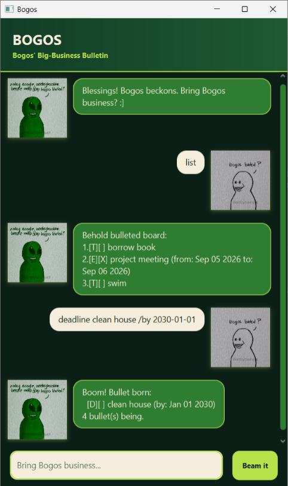

# Bogos User Guide

Bogos is a small chatbot that keeps your task list in order. Type a command in
the message box and press <kbd>Enter</kbd>; Bogos replies in the chat. Your
tasks are saved automatically, so they are still there the next time you open
the app.



## Quick start

Start by adding a task, then view it:

```
todo buy milk
list
```

Each task has a number in `list`. Use that number to mark, unmark, or delete
the task.

## Commands

| What you want to do | Command | Example |
| --- | --- | --- |
| Add a to-do | `todo DESCRIPTION [#TAG]...` | `todo buy milk #errands` |
| Add a deadline | `deadline DESCRIPTION /by YYYY-MM-DD [#TAG]...` | `deadline submit report /by 2026-09-30 #school` |
| Add an event | `event DESCRIPTION /from YYYY-MM-DD /to YYYY-MM-DD [#TAG]...` | `event team meeting /from 2026-10-02 /to 2026-10-03 #work` |
| See all tasks | `list` | `list` |
| Search task descriptions | `find KEYWORD` | `find report` |
| Complete a task | `mark NUMBER` | `mark 2` |
| Reopen a completed task | `unmark NUMBER` | `unmark 2` |
| Remove a task | `delete NUMBER` | `delete 2` |
| Close Bogos | `bye` | `bye` |

## A few helpful details

- Dates must use the format `YYYY-MM-DD`, for example `2026-09-30`. An event's
  end date must be later than its start date.
- Add optional tags to any new task with `#`, such as `#school` or `#urgent`.
  Tags must be unique within that task and cannot contain spaces.
- `find` ignores letter case and searches task descriptions, not tags. It keeps
  the matching tasks in their original order.
- Task numbers start at 1 and can change after you delete a task—run `list` if
  you are unsure which number to use.
- Keep command punctuation as shown: `/by`, `/from`, and `/to` appear once
  each in their respective commands. The `|` character is not supported.
- Bogos does not add duplicate tasks with the same details.

That is all you need—add a task whenever it occurs to you, and let Bogos keep
the bullets together.
